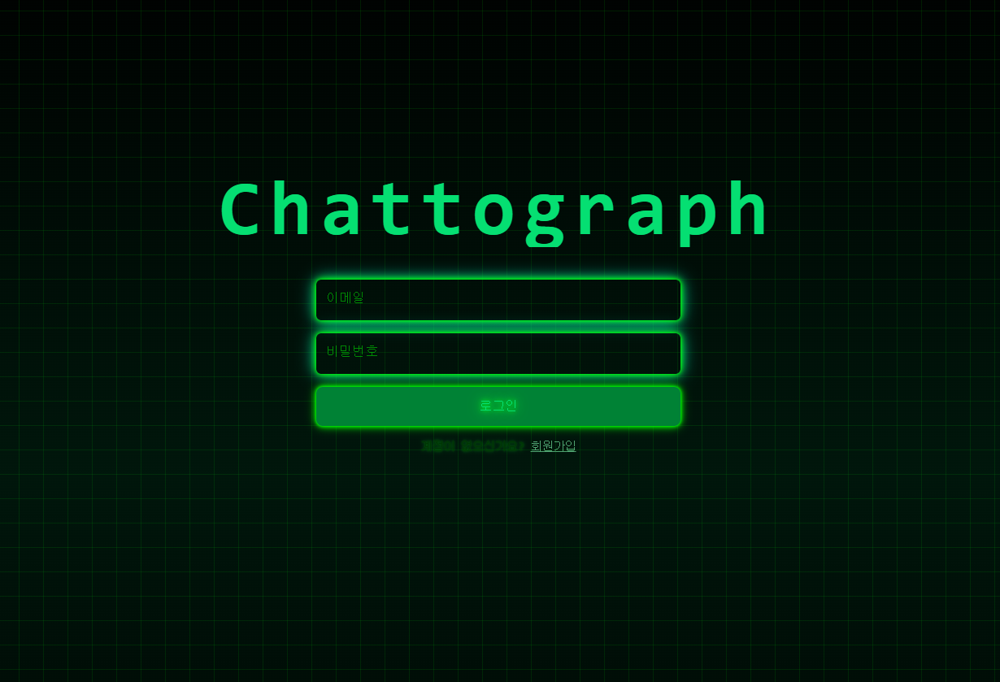
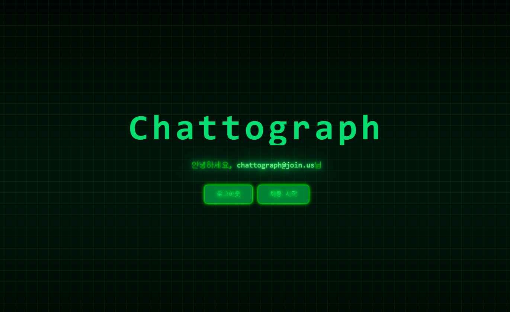
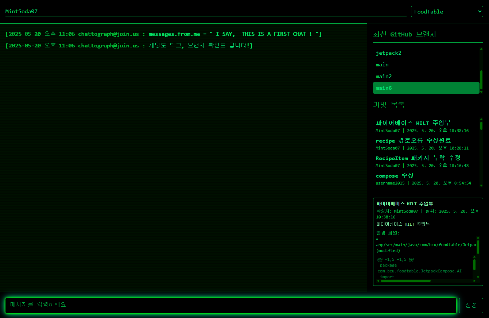

# Chattograph
각종 커뮤니케이션 어플에 비해 메모리 소모가 적은 효율적인 프로젝트 협업 도구입니다.

노트북 환경에서 안드로이드 스튜디오의 에뮬레이터를 실행하면 메모리가 부족하여 카카오톡, 디스코드 등과 크롬을 동시에 사용하기 힘든 문제가 있었기에, 메모리를 작게 소모하면서도 소통, 협업이 가능한 도구를 만들었습니다.

간단한 Firebase 기반 회원가입 / 로그인 진행 후, 프로젝트를 진행하는 동료들끼리 진행도와 채팅을 공유할 수 있도록 하였습니다.

